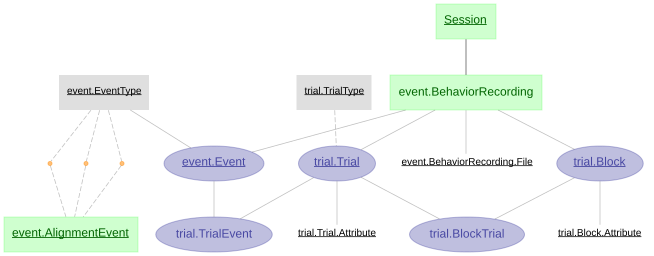

> ## ⚠️ This is the `datajoint-2.x` branch of a fork
>
> Unofficial fork of [`datajoint/element-event`](https://github.com/datajoint/element-event),
> ported to **DataJoint 2.x**. Not affiliated with DataJoint. See
> [why this branch exists](#why-this-branch-exists) at the bottom.

[](http://badge.fury.io/py/element-event)

# DataJoint Element - Experimental trials

+ `element-event` features a DataJoint pipeline design for event, trial, and block management. 

+ `element-event` is not a complete workflow by itself, but rather a modular design of tables and dependencies. 

+ `element-event` can be flexibly attached to any DataJoint workflow.

+ See the [Element Event documentation](https://docs.datajoint.com/elements/element-event/) for the background information and development timeline.

+ For more information on the DataJoint Elements project, please visit <https://docs.datajoint.com/elements/>.  This work is supported by the National Institutes of Health.

## Element architecture

In diagram below, ***BehaviorRecording*** table starts immediately downstream from
***Session***. Recordings can be segmented into both trials, which are assumed to have 
duration, and events, which may be instantaneous. Researchers may find one or both  appropriate for their particular paradigm. A set of trials can be further organized into
blocks, representing a larger span of time. We provide an
[example workflow](https://github.com/datajoint/workflow-trial/) with a
[pipeline script](https://github.com/datajoint/workflow-trial/blob/main/workflow_trial/pipeline.py)
that models combining this Element with the corresponding 
[Element-Session](https://github.com/datajoint/element-session).

### Trial & Event Schemas



## Installation

+ Install `element-event`
    ```
    pip install element-event
    ```

+ Upgrade `element-event` previously installed with `pip`
    ```
    pip install --upgrade element-event
    ```

<!---
+ Install `element-interface`

    + `element-interface` is a dependency of `element-event`, however it is not 
      contained within `requirements.txt`.

    ```
    pip install "element-interface @ git+https://github.com/datajoint/element-interface"
    ```
-->

## Usage

### Element activation

To activate the `element-event`, one need to provide:

1. Schema names for the event or trial module
2. Upstream Session table: A set of keys identifying a recording session (see [
Element-Session](https://github.com/datajoint/element-session)).
3. Utility functions. See 
[example definitions here](https://github.com/datajoint/workflow-trial/blob/main/workflow_trial/paths.py)

For more detail, check the docstring of the `element-event`:

```python
from element_event import event, trial

help(event.activate)
help(trial.activate)
```

### Element usage

+ See the 
[workflow-calcium-imaging](https://github.com/datajoint/workflow-calcium-imaging), 
[workflow-array-ephys](https://github.com/datajoint/workflow-array-ephys), and 
[workflow-miniscope](https://github.com/datajoint/workflow-miniscope) 
repositories for example usages of `element-event`.

## Citation

+ If your work uses DataJoint and DataJoint Elements, please cite the respective Research Resource Identifiers (RRIDs) and manuscripts.

+ DataJoint for Python or MATLAB
    + Yatsenko D, Reimer J, Ecker AS, Walker EY, Sinz F, Berens P, Hoenselaar A, Cotton RJ, Siapas AS, Tolias AS. DataJoint: managing big scientific data using MATLAB or Python. bioRxiv. 2015 Jan 1:031658. doi: https://doi.org/10.1101/031658

    + DataJoint ([RRID:SCR_014543](https://scicrunch.org/resolver/SCR_014543)) - DataJoint for `<Select Python or MATLAB>` (version `<Enter version number>`)

+ DataJoint Elements
    + Yatsenko D, Nguyen T, Shen S, Gunalan K, Turner CA, Guzman R, Sasaki M, Sitonic D, Reimer J, Walker EY, Tolias AS. DataJoint Elements: Data Workflows for Neurophysiology. bioRxiv. 2021 Jan 1. doi: https://doi.org/10.1101/2021.03.30.437358

    + DataJoint Elements ([RRID:SCR_021894](https://scicrunch.org/resolver/SCR_021894)) - Element Event (version `<Enter version number>`)

---

## Why this branch exists

Upstream `element-event` was last committed on 2025-05-20 and targets DataJoint
`>=0.13`. DataJoint **2.0.0** shipped 2026-02-03 as a self-described complete
rewrite; the current release is 2.3.2. Because the element's dependency pin
admits 2.x, `pip install element-event` on a fresh environment today resolves
DataJoint 2.x and produces an installation in which the element cannot be
imported. No element has a 2.x branch and there is no open migration issue or
PR anywhere in the `datajoint` org.

This branch is a working port. It is layered in two commits so the reversible
part can be adopted independently:

| branch | changes | works on 0.14.x | works on 2.x |
|---|---|---|---|
| [`compat-fixes`](../../tree/compat-fixes) | 2 lines: `dj.schema`→`dj.Schema`, `boolean`→`bool`, `enum("x")`→`enum('x')` | **yes** | **yes** |
| `datajoint-2.x` (this branch) | `compat-fixes` **+ 3 × `longblob` → `<blob>`** | **no** | **yes** |

`compat-fixes` is offered upstream as a pull request. This branch is not, because
`<blob>` has no 0.14.x-compatible spelling — 0.14.9 rejects it with
`Support for Adapted Attribute types is disabled`.

### The `longblob` change is not cosmetic

Under DataJoint 2.x a `longblob` attribute is a **raw native column**. It
declares without error and the insert succeeds, but a numpy array written to it
comes back as `bytes`:

```
longblob   (as this element declares it)   -> returned type: bytes     round-trip OK: False
<blob>     (the 2.x codec)                 -> returned type: ndarray   round-trip OK: True
```

Nothing raises. There is no warning. Existing pipeline code fails later, far
from the cause, or silently computes on the wrong thing. See the corresponding
issue on the upstream repo for the full round-trip evidence.

### Using it

```
pip install git+https://github.com/akshay-jaggi/element-event.git@datajoint-2.x
```

Pin the commit rather than the branch name if you need reproducibility. Every
change on both branches was applied mechanically with regexes and reviewed; no
element behaviour was altered, only attribute-type spellings that 2.x renamed or
replaced.
